# Installation
- Download NodeJS from [official](https://nodejs.org/en/download/) site
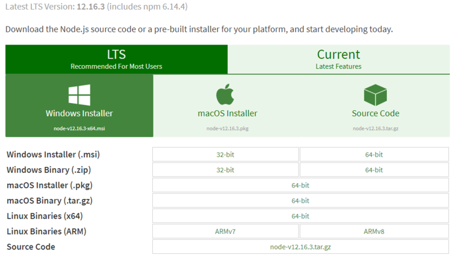
- Go through wizard and install NodeJS

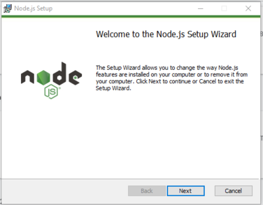
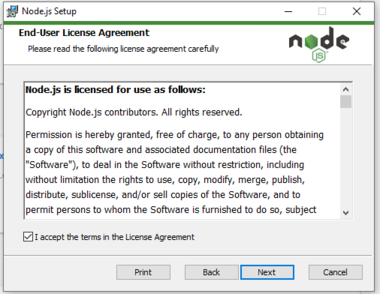
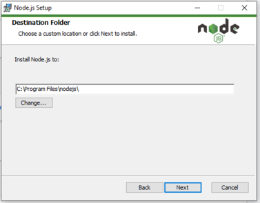
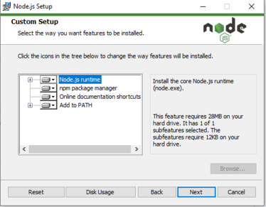
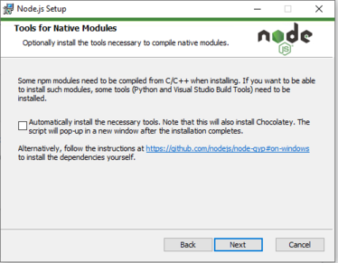
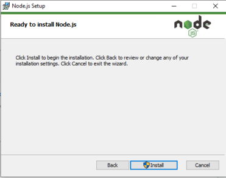
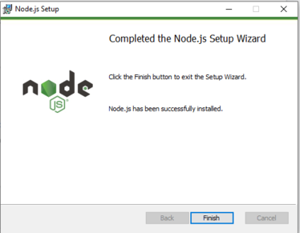
- Go to project and in terminal type following command to install required dependencies
```code 
npm i
```
### IntelliJ
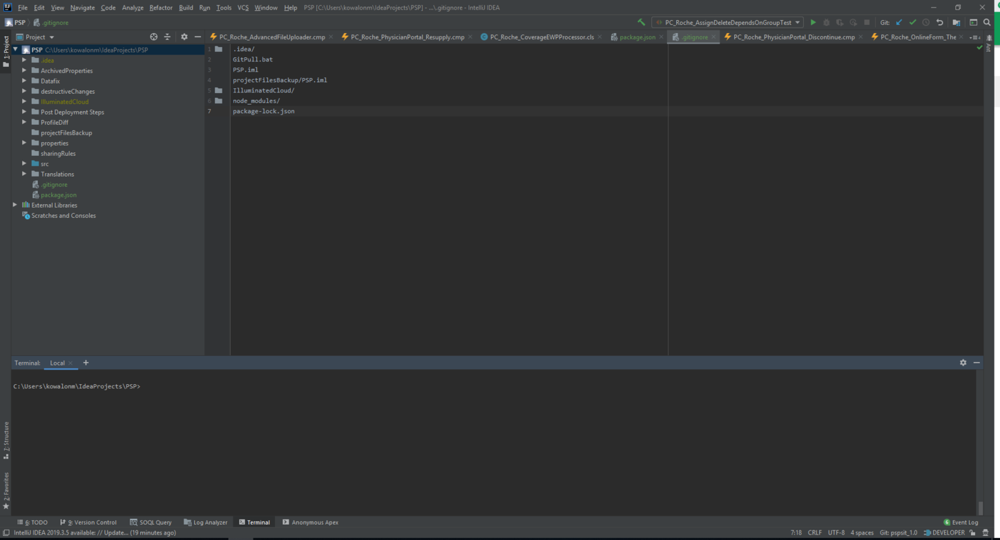
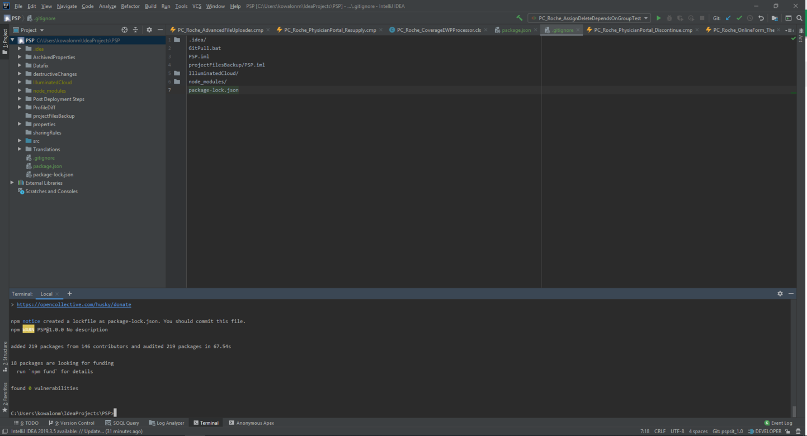
### VSCode
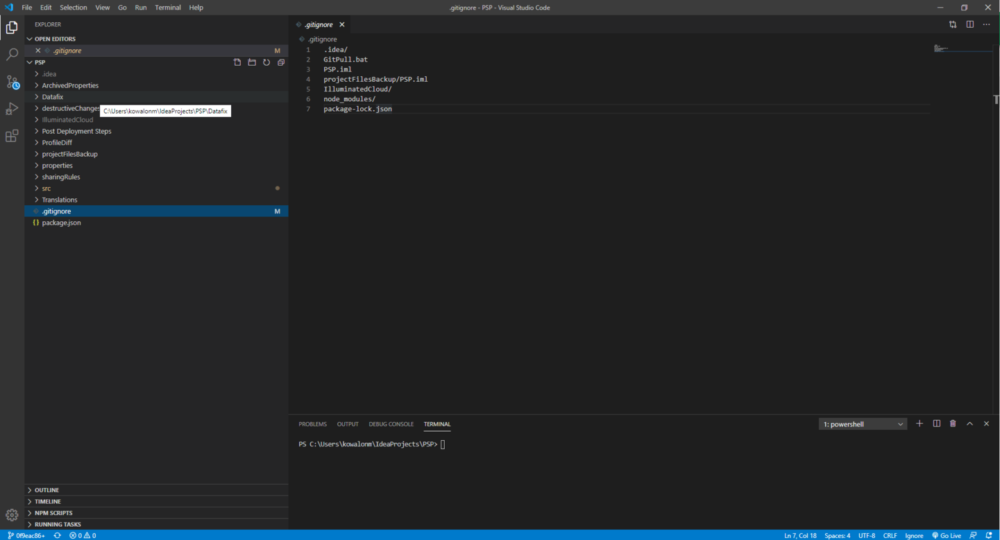
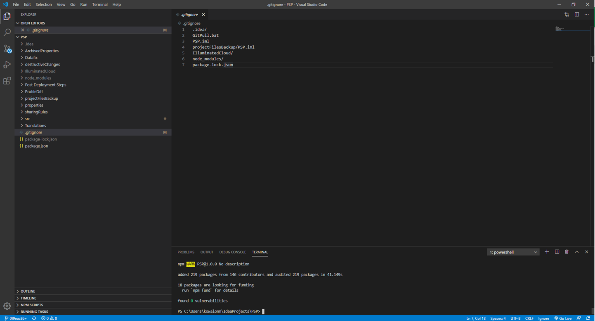
- If there are some errors, just restart editor

<hr style="background-color: red;" />

# Steps to check code
*It is affected only for changed files. At the moment only files with extension .js and .cmp are processed*
- Commit your code
- In sourcetree we get a log which changes need to be fixed manually
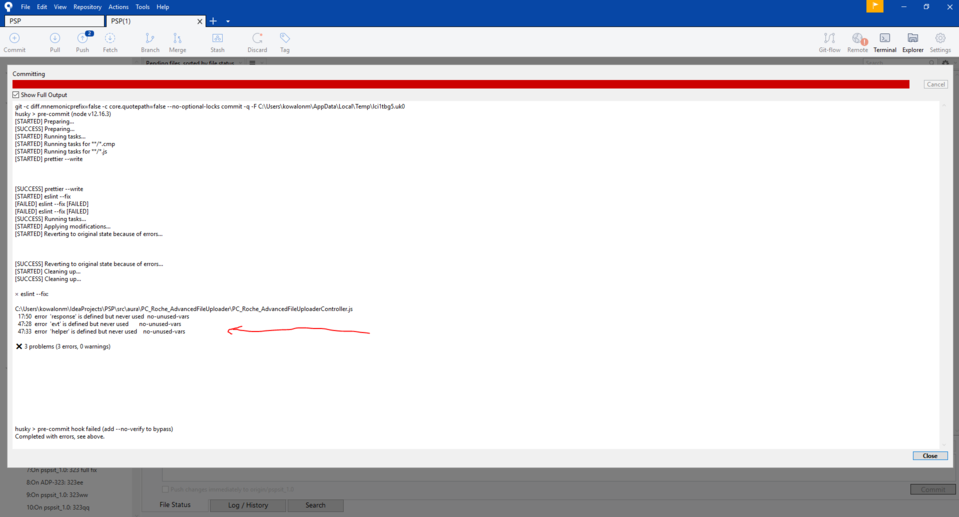
- If something can be fix automatically, It does during commit

<hr style="background-color: red;" />

# Why we should use linters?
- Code is formatted with every commit to repository in the same style
- No need to discuss style in code review
- Less merge conflicts in GIT
- One coding style in each components will help new team members to familarize with code
- Saves time and energy

# PRETTIER
## What is prettier?
Prettier is an opinionated code formatter. It enforces a consistent style by parsing your code and re-printing it with its own rules that take the maximum line length into account, wrapping code when necessary.
## SYNTAX

```json
"prettier": {
    "rule": value
}
```
## RULES
## [tabWidth](https://prettier.io/docs/en/options.html#tab-width)

Specify the number of spaces per indentation-level. Default: 2

## [singleQuote](https://prettier.io/docs/en/options.html#quotes)

Use single quotes instead of double quotes. Default: false


<hr style="background-color: red;" />

# ESLINT
## What is eslint?
Code linting is a type of static analysis that is frequently used to find problematic patterns or code that doesn't adhere to certain style guidelines. 

JavaScript, being a dynamic and loosely-typed language, is especially prone to developer error. Without the benefit of a compilation process, JavaScript code is typically executed in order to find syntax or other errors. Linting tools like ESLint allow developers to discover problems with their JavaScript code without executing it.

The primary reason ESLint was created was to allow developers to create their own linting rules. ESLint is designed to have all rules completely pluggable. The default rules are written just like any plugin rules would be. They can all follow the same pattern, both for the rules themselves as well as tests. 
## SYNTAX

```json
"eslintConfig": {
	"rules": {
		"rule": [level, options],
		"rule2": level
	}
}
```

- rules with <span style="padding: 2px 4px;font-size: 90%;color: #5b5be0;background-color: #d4d4f7;border-radius: 4px;">level</span> 0 or "off" will be turn off
- rules with <span style="padding: 2px 4px;font-size: 90%;color: #5b5be0;background-color: #d4d4f7;border-radius: 4px;">level</span> 1 or "warn" will be treat as warning, they dont block our commit, but we can treat them as a suggestion
- rules with <span style="padding: 2px 4px;font-size: 90%;color: #5b5be0;background-color: #d4d4f7;border-radius: 4px;">level</span> 2 or "error" will be treat as error and they will block our commit
- <span style="padding: 2px 4px;font-size: 90%;color: #5b5be0;background-color: #d4d4f7;border-radius: 4px;">options</span> parameter is assigning for rules to override standard validation

## RULES
## [prefer-const](https://eslint.org/docs/2.0.0/rules/prefer-const)

If a variable is never modified, Better idea is using the <span style="padding: 2px 4px;font-size: 90%;color: #5b5be0;background-color: #d4d4f7;border-radius: 4px;">const</span> declaration.
const declaration tells readers, *this variable is never modified*, reducing cognitive load and improving maintainability. <span style="padding: 2px 4px;font-size: 90%;color: #5b5be0;background-color:lime;border-radius: 4px;">Fixable automatically</span>

### Rule Details
This rule is aimed at flagging variables that are declared using <span style="padding: 2px 4px;font-size: 90%;color: #5b5be0;background-color: #d4d4f7;border-radius: 4px;">let</span> keyword, but never modified after the initial assignment.

**The following patterns are considered problems:**
```javascript
let a = 3; //error 'a' is never modified, use 'const' instead.*/
```
```javascript
// `i` is re-defined (not modified) on each loop step.
for (let i in [1,2,3]) { //error 'i' is never modified, use 'const' instead.
    console.log(i);
}
```
```javascript
// `a` is re-defined (not modified) on each loop step.
for (let a of [1,2,3]) { //error 'a' is never modified, use 'const' instead.
    console.log(a);
}
```

**Options:**
###### destructuring
- <span style="padding: 2px 4px;font-size: 90%;color: #5b5be0;background-color: #d4d4f7;border-radius: 4px;">"any"</span> - If any variables in destructuring should be <span style="padding: 2px 4px;font-size: 90%;color: #5b5be0;background-color: #d4d4f7;border-radius: 4px;">const</span>, this rule warns for those variables.

**Examples of incorrect code for the <span style="padding: 2px 4px;font-size: 90%;color: #5b5be0;background-color: #d4d4f7;border-radius: 4px;">{"destructuring": "any"}</span> option:**
```javascript
let {a, b} = obj;    /*error 'b' is never reassigned, use 'const' instead.*/
a = a + 1;
```

## [no-var](https://eslint.org/docs/rules/no-var)

ES6 allows programmers to create variables with block scope instead of function scope using the <span style="padding: 2px 4px;font-size: 90%;color: #5b5be0;background-color: #d4d4f7;border-radius: 4px;">let</span> and <span style="padding: 2px 4px;font-size: 90%;color: #5b5be0;background-color: #d4d4f7;border-radius: 4px;">const</span> keywords. Block scope is common in many other programming languages and helps programmers avoid mistakes related to scope. <span style="padding: 2px 4px;font-size: 90%;color: #5b5be0;background-color:lime;border-radius: 4px;">Fixable automatically</span>

### Rule Details
This rule is aimed at discouraging the use of <span style="padding: 2px 4px;font-size: 90%;color: #5b5be0;background-color: #d4d4f7;border-radius: 4px;">var</span> and encouraging the use of <span style="padding: 2px 4px;font-size: 90%;color: #5b5be0;background-color: #d4d4f7;border-radius: 4px;">const</span> or <span style="padding: 2px 4px;font-size: 90%;color: #5b5be0;background-color: #d4d4f7;border-radius: 4px;">let</span> instead.

**The following patterns are considered problems:**
```javascript
var x = "y";
var CONFIG = {};
//Unexpected var, use let or const instead.
```

## [no-unused-vars](https://eslint.org/docs/rules/no-unused-vars)

Variables that are declared and not used anywhere in the code are most likely an error due to incomplete refactoring. Such variables take up space in the code and can lead to confusion by readers.

### Rule Details
This rule is aimed at eliminating unused variables, functions, and function parameters.

**The following patterns are considered problems:**
```javascript
// Write-only variables are not considered as used.
var y = 10;
y = 5;
```
```javascript
// A read for a modification of itself is not considered as used.
var z = 0;
z = z + 1;
```
```javascript
// Unused arguments cause warnings.
function(foo) {
    return 5;
}
```
```javascript
// When a function definition destructures an array, unused entries from the array also cause warnings.
function getY([x, y]) {
    return y;
}
```

## [eqeqeq](https://eslint.org/docs/rules/eqeqeq)

It is considered good practice to use the type-safe equality operators <span style="padding: 2px 4px;font-size: 90%;color: #5b5be0;background-color: #d4d4f7;border-radius: 4px;">===</span> and <span style="padding: 2px 4px;font-size: 90%;color: #5b5be0;background-color: #d4d4f7;border-radius: 4px;">!==</span> instead of their regular counterparts <span style="padding: 2px 4px;font-size: 90%;color: #5b5be0;background-color: #d4d4f7;border-radius: 4px;">==</span> and <span style="padding: 2px 4px;font-size: 90%;color: #5b5be0;background-color: #d4d4f7;border-radius: 4px;">!=</span>. The reason for this is that <span style="padding: 2px 4px;font-size: 90%;color: #5b5be0;background-color: #d4d4f7;border-radius: 4px;">==</span> and <span style="padding: 2px 4px;font-size: 90%;color: #5b5be0;background-color: #d4d4f7;border-radius: 4px;">!=</span> do type coercion which follows the rather obscure Abstract Equality Comparison Algorithm. For instance, the following statements are all considered <span style="padding: 2px 4px;font-size: 90%;color: #5b5be0;background-color: #d4d4f7;border-radius: 4px;">true</span>.
```javascript
[] == false //true
[] == ![] //true
3 == "03" //true
```
<span style="padding: 2px 4px;font-size: 90%;color: #5b5be0;background-color:lime;border-radius: 4px;">Fixable automatically</span>

### Rule Details
This rule is aimed at eliminating the type-unsafe equality operators.

**The following patterns are considered problems:**

```javascript
if (x == 42) { } //Expected '===' and instead saw '=='.

if ("" == text) { } //Expected '===' and instead saw '=='.

if (obj.getStuff() != undefined)  { } //Expected '!==' and instead saw '!='.
```

## [dot-notation](https://eslint.org/docs/rules/dot-notation)

In JavaScript, one can access properties using the dot notation (<span style="padding: 2px 4px;font-size: 90%;color: #5b5be0;background-color: #d4d4f7;border-radius: 4px;">foo.bar</span>) or square-bracket notation (<span style="padding: 2px 4px;font-size: 90%;color: #5b5be0;background-color: #d4d4f7;border-radius: 4px;">foo["bar"]</span>). However, the dot notation is often preferred because it is easier to read.
<span style="padding: 2px 4px;font-size: 90%;color: #5b5be0;background-color:lime;border-radius: 4px;">Fixable automatically</span>

### Rule Details
This rule is aimed at maintaining code consistency and improving code readability by encouraging use of the dot notation style whenever possible. As such, it will warn when it encounters an unnecessary use of square-bracket notation.

**The following patterns are considered problems:**

```javascript
var x = foo["bar"]; //["bar"] is better written in dot notation.
```

## [camelcase](https://eslint.org/docs/rules/camelcase)

This rule focuses on using the camelcase approach.

### Rule Details
This rule looks for any underscores (_) located within the source code. It ignores leading and trailing underscores and only checks those in the middle of a variable name. If ESLint decides that the variable is a constant (all uppercase), then no warning will be thrown. Otherwise, a warning will be thrown.

**The following patterns are considered problems:**

```javascript
const foo_bar = 10; //Identifier 'foo_bar' is not in camel case.
```

## [no-multi-spaces](https://eslint.org/docs/rules/no-multi-spaces)

Multiple spaces in a row that are not used for indentation are typically mistakes. <span style="padding: 2px 4px;font-size: 90%;color: #5b5be0;background-color:lime;border-radius: 4px;">Fixable automatically</span>

### Rule Details
This rule aims to disallow multiple whitespace around logical expressions, conditional expressions, declarations, array elements, object properties, sequences and function parameters.

**The following patterns are considered problems:**

```javascript
var a =  1; //Multiple spaces found before '1'.
if(foo   === "bar") {} //Multiple spaces found before '==='.
var arr = [1,  2]; //Multiple spaces found before '2'.
a ?  b: c //Multiple spaces found before 'b'.
```
